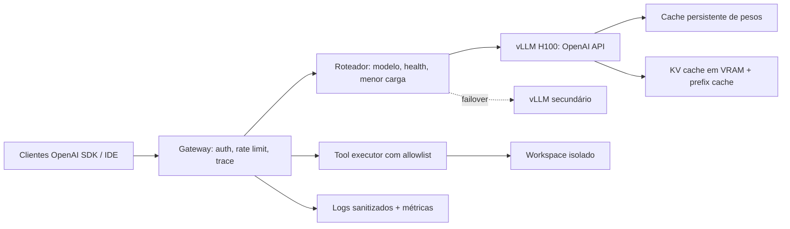

# SENSIX AI Runtime Reference

Referência pública para servir modelos open-weight com API compatível com OpenAI em Pod GPU ou Serverless.

O desenho principal atende uma H100 de 80 GB com `openai/gpt-oss-120b` e vLLM. Ele separa inferência, gateway, execução de ferramentas, cache e telemetria para que nenhum segredo seja enviado ao modelo ou registrado em texto aberto.

## Arquitetura



Leia [a arquitetura completa](docs/architecture.md), o [runbook de operação](docs/runbook.md) e o [contrato OpenAI](docs/openai-contract.md). Há também fragmentos executáveis para [tools com allowlist](examples/tool_executor.py) e [JSON estruturado com uma única recuperação](examples/structured_completion.py).

## Início rápido: Pod H100 80 GB

1. Crie um Pod com H100 PCIe 80 GB, Ubuntu 24.04, Docker e NVIDIA Container Toolkit.
2. Copie `.env.example` para `.env` e preencha somente no host. Nunca versione `.env`.
3. Inicie `docker compose --env-file .env -f docker/compose.pod-h100.yml up -d`.
4. Exponha somente o gateway por TLS. O vLLM fica na rede privada do Compose.

```bash
curl https://gateway.example.com/v1/models \
  -H "Authorization: Bearer $SENSIX_GATEWAY_API_KEY"
```

O compose usa a imagem oficial `vllm/vllm-openai:v0.28.0`, fixada por versão. O modelo `gpt-oss-120b` é MXFP4 e foi projetado para uma GPU de 80 GB.

## Perfis recomendados

| Perfil | Modelo | GPU | Uso |
|---|---|---|---|
| `reasoning-80g` | `openai/gpt-oss-120b` | 1× H100/A100 80 GB | raciocínio, tools, arquitetura |
| `coding-efficient` | `Qwen/Qwen3-Coder-30B-A3B-Instruct` | 1× L40S 48 GB | agente de código diário |
| `coding-premium` | `Qwen/Qwen3-Coder-Next-FP8` | 2× H100 80 GB | tarefas complexas de código |

## Segurança operacional

- Ferramentas são executadas pelo gateway, nunca pelo processo do modelo.
- Credenciais ficam no ambiente do executor; logs guardam hashes, trace ID e metadados, nunca tokens.
- O gateway aceita somente ferramentas declaradas no allowlist e paths montados no workspace.
- Auto-reparo de JSON acontece no máximo uma vez e apenas no modo não-streaming.
- Streaming preserva SSE OpenAI e termina com `[DONE]`; erros usam envelope OpenAI e `traceId` para correlação.

## CI e imagem

O workflow valida o Compose e os contratos Python em pull requests. Ao chegar em `main`, publica a imagem do gateway em GHCR como `ghcr.io/sensixblackdev/sensix-ai-runtime-gateway`.

## Licença

MIT. Consulte as licenças dos modelos antes de distribuí-los.
